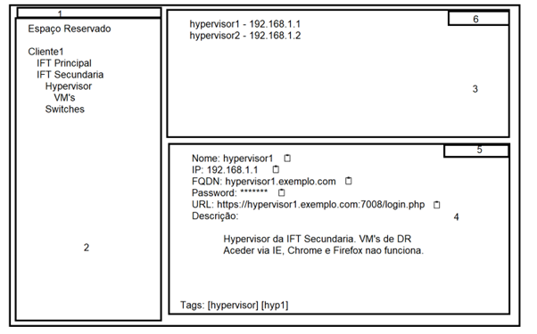
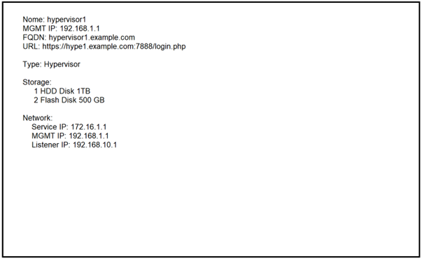
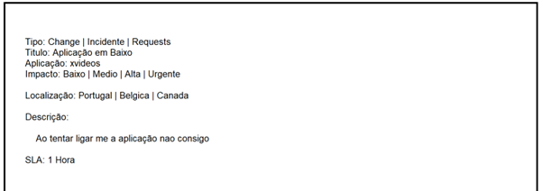

# Introdução
Este documento tem como objetivo detalhar a ideia de Gonçalo Sousa em centralizar uma ferramenta de ticketing, configuration management database (CMDB) e password management\
PacketDB – PAssword ticKET cmDB – Nome ainda em pensamento

# Objectivo

# Visualização

## Password Management
O core seria adicionar 8 campos, Titulo, IP, FQDN, Utilizador, Password, URL, Descrição e Tags. Esta solução seria feita em Folder Tree com as devidas pastas e um espaço reservado ao utilizador para colocar as suas credenciais de sites e/ou utilizadores de servidor. A configuração das entradas será herdada pela pasta. E um quicksearch para faciliatar. Por exemplo:

## CMDB
Um espaço para fazer inventario das infraestruras, seja VM, Aplicações URL, Switches, Routers, etc.\
Este espaço podesse adicionar manualmente a informação e costumizar os campos consoante a necessidade. Num formato semelhante a solução anterior, “Folder Tree”.

## Ticketing
Changes, Incidents e Requests.\
Este espaço também terá um espaço de Wiki onde se pode documentar vários incidentes e changes e associar os mesmos a documentação\
Apenas se pode abrir ticket com a indicação do recurso afetado:

